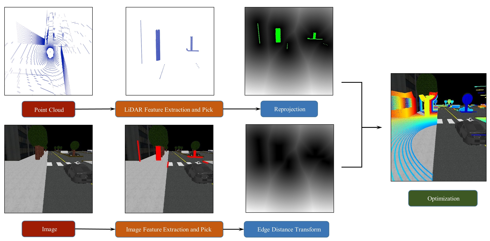
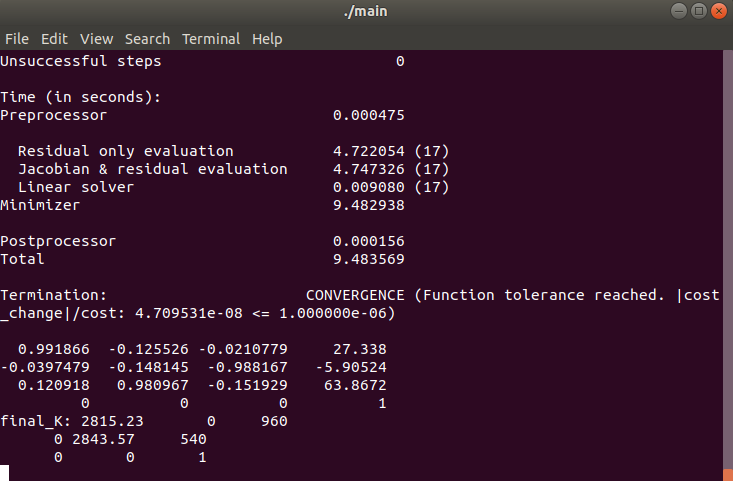
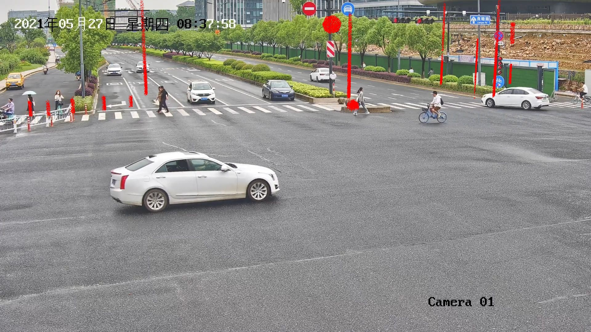

## Intrinsic and Extrinsic Calibration of Roadside LiDAR and Camera

#### Method



#### Requirements

- ＞=cmake 3.10
- pcl 1.8
- Eigen3
- Ceres 2.0.0
- OpenCV 3.4.5

#### Usage

- We provide tests in real world traffic scenes. There are two examples in real world traffic scenes in feature folder. The feature/feature folder stores the selected 2d features. The feature/feature_bit is the bit image for distance transform(This is auto generated). The feature/3d_feature folder stores the selected 3d features.

- If you want to extract features by hand, refer to doc/extract_feature.md

- Run the example

  - modify the initial intrinsic and extrinsic paramter in config/param.yaml like:

    ```
    # image0
    image_path: "/home/jingxin/traffic-LiDAR-camera-calibration/feature/image2/image2.jpg"
    feature_num: 15
    fx: 2000
    fy: 2000
    cx: 960
    cy: 540
    extrinsic: [9.88910941e-01,  1.48500658e-01,  1.64494210e-03,  2.20000000e+01,
                5.18266263e-02, -3.34706924e-01, -9.40895996e-01, -1.50000000e+01,
                -1.39173101e-01,  9.30547597e-01, -3.38691627e-01,  8.00000000e+01,
                0.00000000e+00,  0.00000000e+00,  0.00000000e+00,  1.00000000e+00]
    ```

  - build and run main.cpp
  
    ```
    cd traffic-LiDAR-camera_calibration
    mkdir build
    cd build
    cmake ..
    make
    ./main
    ```
  
- Results:

  After the convergence, you will see the results like this:

  

  The intrinsic and extrinsic results will be printed on the console. And the initial reproject and final reproject will be shown like this.
  
  initial:
  
  
  
  final:
  
  

#### Demo Gif


#### TODO

- [ ] rough calibration(coming soon)
- [ ] simulation code(coming soon)

